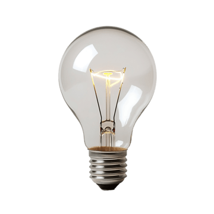

### 1. Change Heading Text

**HTML:**

```html
<h1 id="main-title">Old title</h1>
<button id="change-title-btn">Change title</button>
```

**Task:**

* Select the `<h1>` element by its **id**.
* When the button is clicked, change the heading text to:
  `New amazing title`.

---

### 2. Highlight All List Items

**HTML:**

```html
<ul id="todo-list">
  <li>Learn JS</li>
  <li>Practice DOM</li>
  <li>Build a project</li>
</ul>
<button id="highlight-btn">Highlight items</button>
```

**Task:**

* Select **all** `<li>` elements inside `#todo-list`.
* When the button is clicked, change the text color of all `<li>` items to **red**.

---

### 3. Toggle Dark Mode Class

**HTML:**

```html
<div id="page">
  <p>Some content on the page...</p>
  <button id="toggle-theme-btn">Toggle dark mode</button>
</div>
```

**CSS idea (you can give them or tell them to create):**

```css
.dark {
  background-color: #333;
  color: white;
}
```

**Task:**

* When the button is clicked, toggle the class `"dark"` on the `#page` `<div>` using `classList.toggle`.

---

### 4. Add New List Item from Input

**HTML:**

```html
<input id="item-input" type="text" placeholder="New item">
<button id="add-item-btn">Add item</button>

<ul id="items">
  <li>Example item</li>
</ul>
```

**Task:**

* When the button is clicked:

  * Read the value from the input.
  * Create a new `<li>` element.
  * Set its text to the input value.
  * Append it to the `#items` list.
  * Clear the input afterwards.

---

### 5. Change Image `src` and `alt`

**HTML:**

```html

<button id="change-img-btn">Change image</button>
```

**Task:**

* When the button is clicked, change:

  * the image `src` attribute to `"img2.png"`,
  * the `alt` attribute to `"Second image"`.

Use `setAttribute` or direct properties (`img.src = ...`).

---

### 6. Show/Hide Paragraph

**HTML:**

```html
<p id="secret-text">This is a secret paragraph.</p>
<button id="toggle-text-btn">Hide</button>
```

**Task:**

* When the button is clicked:

  * If the paragraph is visible, hide it (e.g. `display: none`) and change button text to `"Show"`.
  * If it is hidden, show it and change button text back to `"Hide"`.

Use `style.display` or a CSS class.

---

### 7. Mouseover Highlight Box

**HTML:**

```html
<div id="box" style="width:150px; height:150px; border:1px solid black;">
  Hover me
</div>
```

**Task:**

* When the mouse enters the box (`mouseover`), change its background color (e.g. yellow).
* When the mouse leaves the box (`mouseout`), remove the background color (return to original).

---

### 8. Live Character Counter

**HTML:**

```html
<textarea id="message" rows="4" cols="30"></textarea>
<p>Characters: <span id="char-count">0</span></p>
```

**Task:**

* Listen to the `input` event on the textarea.
* On every change, update `#char-count` with the current number of characters in the textarea (`value.length`).

---

### 9. Simple Tab Switcher

**HTML:**

```html
<button class="tab-btn" data-target="tab1">Tab 1</button>
<button class="tab-btn" data-target="tab2">Tab 2</button>

<div id="tab1" class="tab">Content of tab 1</div>
<div id="tab2" class="tab">Content of tab 2</div>
```
Čia tiesiog "junginėti" mygtukus reikia ir kad atitinkamai rodytų turinį: